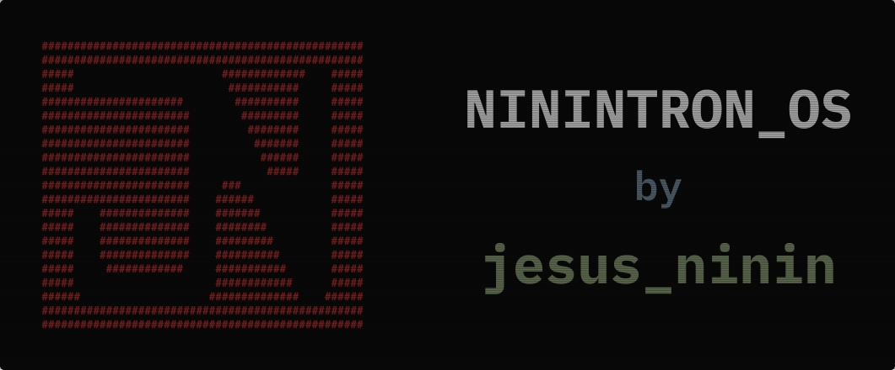

<div align="center">
  

  <br />

  [](https://astro.build/)
  [](https://developer.mozilla.org/es/docs/Web/JavaScript)
  [](https://developer.mozilla.org/es/docs/Web/CSS)
  [](https://nodejs.org/)
  [](./LICENSE)

  <p align="center">
    <strong>NININTRON_OS</strong> es un portafolio web interactivo que recrea la experiencia visual y funcional de un Sistema Operativo retro-moderno con interfaz de terminal (CLI) y ventanas flotantes. Desarrollado con <strong>Astro 7</strong>, <strong>HTML5 semántico</strong>, <strong>CSS3 puro</strong> (mediante variables de diseño) y <strong>Vanilla JavaScript</strong> modular, garantizando un rendimiento óptimo, accesibilidad de primer nivel y fidelidad milimétrica al sistema de diseño.
  </p>

  <p align="center">
    <a href="https://ninin.online" target="_blank"><strong>🌐 Explorar Demo en Vivo (ninin.online)</strong></a>
  </p>
</div>

---

## 📑 Tabla de Contenidos

1. [Visión General y Filosofía](#-visión-general-y-filosofía)
2. [Características Principales](#-características-principales)
   - [Gestor de Ventanas Retro (Multi-Window Manager)](#1-gestor-de-ventanas-retro-multi-window-manager)
   - [Simulador de Monitor CRT](#2-simulador-de-monitor-crt-svg-filters--noise)
   - [Navegación Bi-Axial y Gestor de Layout](#3-navegación-bi-axial-y-gestor-de-layout)
   - [Internacionalización Completa (i18n)](#4-internacionalización-completa-i18n-esen)
   - [Animaciones CLI Typewriter](#5-animaciones-cli-typewriter)
   - [Formulario de Contacto Funcional](#6-formulario-de-contacto-funcional-web3forms)
   - [Barra de Estado Dinámica y Rotador de Citas](#7-barra-de-estado-dinámica-y-rotador-de-citas)
   - [SEO, Accesibilidad y Rendimiento](#8-seo-accesibilidad-a11y-y-rendimiento)
3. [Estructura del Proyecto](#-estructura-del-proyecto)
4. [Sistema de Diseño y Tokens CSS](#-sistema-de-diseño-y-tokens-css)
5. [Stack Tecnológico](#-stack-tecnológico)
6. [Instalación y Configuración Local](#-instalación-y-configuración-local)
7. [Despliegue y Configuración de Servidor](#-despliegue-y-configuración-de-servidor)
8. [Créditos y Autor](#-créditos-y-autor)

---

## 🚀 Visión General y Filosofía

El proyecto **NININTRON_OS** fue concebido bajo directrices arquitectónicas estrictas:
- **Zero CSS Frameworks:** No utiliza Tailwind CSS, Bootstrap ni ninguna librería de componentes. Todos los estilos están escritos en CSS puro modular utilizando Custom Properties (`tokens.css`).
- **HTML Semántico y Accesibilidad (WCAG):** Estructura jerárquica con etiquetas semánticas (`header`, `main`, `aside`, `section`, `article`, `footer`, `nav`), soporte completo de teclado, gestión del atributo `inert` en paneles inactivos, atrapamiento de foco en ventanas modales (`focus trap`) y etiquetas `aria-*` dinámicas.
- **Rendimiento Máximo (SSG):** Generación estática impulsada por Astro, optimización de fuentes (`@fontsource/ibm-plex-mono`), compresión de imágenes con `sharp`, optimización SVG y cabeceras de caché inmutable.

---

## ✨ Características Principales

### 1. Gestor de Ventanas Retro (Multi-Window Manager)
Ubicado en `src/scripts/window-detail.js`, controla el ciclo de vida de múltiples ventanas OS simultáneas e independientes:
- **Cascada Automática:** Las ventanas se abren con un desplazamiento escalonado (`cascadeOffset`) para evitar solapamientos iniciales.
- **Arrastre y Posicionamiento (Drag & Drop):** Soporte de arrastre dentro de los límites del contenedor (`clampWindowInsideContainer`) tanto en porcentajes como en píxeles.
- **Minimizado Inteligente & Anti-Colisión:** Al minimizar, la ventana se acopla en la barra inferior calculando el primer espacio horizontal disponible (`getFirstFreeMinimizedLeft`) sin chocar con otras ventanas minimizadas. En dispositivos móviles, se apilan verticalmente.
- **Maximizado y Restauración:** Guarda y restaura las coordenadas previas (`capturePosition`).
- **Gestión de Capas (Z-Index Manager):** Cada clic o foco eleva dinámicamente el `z-index` de la ventana activa.
- **Cierre Rápido & Accesibilidad:** Tecla `Escape` cierra la ventana superior activa; el foco se atrapa cíclicamente dentro de la ventana abierta y regresa al disparador al cerrarse.

### 2. Simulador de Monitor CRT (SVG Filters & Noise)
Implementado en `src/scripts/crt.js` y `src/styles/components/crt.css`:
- **Filtros SVG Nativos:** Efecto de aberración cromática con separación de canales rojo/azul (`feColorMatrix`, `feOffset`, `feBlend`) y máscara radial de viñeta.
- **Ruido Analógico en Tiempo Real:** Generación de grano analógico procedural mediante `feTurbulence` animado con `requestAnimationFrame` a ~20 FPS.
- **Efecto de Curvatura y Scanlines:** Líneas de escaneo y brillo fosfórico CGA personalizables por tokens CSS.
- **Persistencia & Movimiento Reducido:** Botón de alternancia `[CRT]` en la barra superior con persistencia en `localStorage` y desactivación automática si el usuario tiene activado `prefers-reduced-motion`.

### 3. Navegación Bi-Axial y Gestor de Layout
Implementado en `src/scripts/layout-manager.js`:
- **Desktop (Eje X):** Desplazamiento horizontal instantáneo entre paneles estilo terminal.
- **Mobile/Tablet (Eje Y):** Desplazamiento vertical fluido con menú lateral responsivo tipo cajón (drawer) accesible mediante botón `[= MENU]`.
- **IntersectionObserver:** Sincroniza dinámicamente el título del panel activo en la barra superior (`MAIN.EXE`, `NININ.EXE`, `PROYECTOS.EXE`, etc.) y resalta la opción activa en el menú lateral (`aria-current="page"`).
- **History API y Deep Linking:** Soporte de navegación con botones Atrás/Adelante del navegador (`popstate`) y carga directa por hash en la URL (ej. `#proyectos`, `#sobre-mi`, `#contacto`).

### 4. Internacionalización Completa (i18n: ES/EN)
Ubicada en `src/i18n/`:
- Soporte multilingüe integral para **Español (`/es`)** e **Inglés (`/en`)**.
- Redirección automática de idioma en la raíz (`/`) basada en preferencias del navegador y reglas de servidor en `vercel.json`.
- Selector de idioma interactivo `[ES] / [EN]` en el `Topbar`.
- Inyección de etiquetas SEO `hreflang` y URL canónicas dinámicas en `BaseLayout.astro`.

### 5. Animaciones CLI Typewriter
Implementado en `src/scripts/cli-entrance.js`:
- Efecto de tipeo mecánico con velocidad constante por carácter (`CLI_CHAR_SPEED = 40ms`) para títulos y comandos terminales.
- Entrada escalonada con desvanecimiento (`fade-in`) para bloques de texto y datos.
- Compatible con lectores de pantalla y modo de movimiento reducido.

### 6. Formulario de Contacto Funcional (Web3Forms)
Implementado en `src/components/sections/SectionContacto.astro` y `src/scripts/contact-form.js`:
- Apariencia de comando Unix (`mail -s "CONTACTO" nj13072004@gmail.com`).
- Integración asíncrona mediante `fetch` con la API de Web3Forms.
- Validación interactiva de campos (`:invalid`, `was-validated`) con foco automático en el primer campo erróneo y mensajes de estado localizados (Enviando, Éxito, Error).
- Protección anti-spam mediante campo señuelo (`honeypot / botcheck`).

### 7. Barra de Estado Dinámica y Rotador de Citas
- **Statusbar (`Statusbar.astro`):** Muestra el estado del sistema con reloj digital en tiempo real (`HH:MM:SS`) y simulación dinámica de memoria RAM utilizada (`MEM: 64%`), pausando sus intervalos si la pestaña pasa a segundo plano (`visibilitychange`).
- **Rotador de Citas (`text-rotator.js`):** Alterna frases y citas aleatorias de forma periódica en la sección de presentación personal (`SectionNinin.astro`).

### 8. SEO, Accesibilidad (a11y) y Rendimiento
- **Marcado Semántico Puro:** Cero etiquetas `div` innecesarias.
- **Datos Estructurados:** JSON-LD Schema.org tipo `Person` con enlaces profesionales (GitHub, LinkedIn).
- **OpenGraph & Twitter Cards:** Metadatos completos e imágenes de previsualización optimizadas (`og-image.png`).
- **Preconexión y Prefetch:** `dns-prefetch` para la API de Web3Forms y carga prioritaria de fuentes.

---

## 📁 Estructura del Proyecto

```
portfolio-ninin/
├── 📂 .github/                     # Recursos y banners del repositorio
│   └── 📂 assets/
│       └── 📄 NININTRON_OS_PORTFOLIO_BANNER.svg
├── 📂 Fase 1/                      # Documentación de análisis de diseño (Figma)
├── 📂 Fase 2/                      # Documentación de arquitectura de software
├── 📂 Fase 3/                      # Especificación y arquitectura de componentes
├── 📂 Maquetacion/                 # Diseños SVG originales (Desktop, Tablet, Phone)
├── 📂 public/                      # Archivos estáticos servidos directamente
│   ├── 📄 apple-touch-icon.png     # Icono para dispositivos Apple
│   ├── 📄 favicon.ico              # Favicon estándar
│   ├── 📄 favicon.svg              # Favicon vectorial retro
│   ├── 📄 robots.txt               # Directivas de rastreo para motores de búsqueda
│   └── 📄 site.webmanifest         # Manifiesto de aplicación web (PWA ready)
├── 📂 src/
│   ├── 📂 assets/                  # Assets procesados por el pipeline de Astro
│   │   ├── 📂 icons/               # Iconos vectoriales (github.svg, linkedin.svg)
│   │   └── 📂 images/              # Logos, fotos ASCII y tarjeta OpenGraph
│   ├── 📂 components/              # Componentes UI de Astro
│   │   ├── 📂 primitives/          # Componentes atómicos/primitivas CLI
│   │   │   ├── 📄 Btn.astro            # Botones interactivos estilizados
│   │   │   ├── 📄 Cursor.astro         # Cursor parpadeante terminal
│   │   │   ├── 📄 InputLine.astro      # Línea de entrada / campo de formulario
│   │   │   ├── 📄 Output.astro         # Salida de texto formateada
│   │   │   ├── 📄 ProgressBar.astro    # Barra de progreso ASCII/bloques
│   │   │   ├── 📄 Prompt.astro         # Prompt de línea de comando (ej. $ >)
│   │   │   ├── 📄 Separator.astro      # Separador horizontal terminal
│   │   │   ├── 📄 Statusbar.astro      # Barra inferior con reloj y memoria RAM
│   │   │   └── 📄 TerminalHeader.astro # Cabecera de bloque con comando
│   │   ├── 📂 sections/            # Secciones principales del portafolio
│   │   │   ├── 📄 SectionBienvenida.astro  # Portada y logotipo NININTRON_OS
│   │   │   ├── 📄 SectionNinin.astro       # Presentación, citas y foto ASCII
│   │   │   ├── 📄 SectionProyectos.astro   # Listado y capa de ventanas de proyectos
│   │   │   ├── 📄 SectionAbout.astro       # Ficha técnica, educación y habilidades
│   │   │   ├── 📄 SectionContacto.astro    # Formulario CLI de contacto
│   │   │   ├── 📄 SectionHelp.astro        # Manual de usuario y comandos
│   │   │   └── 📄 SectionTransition.astro  # Módulo de transición de carga
│   │   └── 📂 ui/                  # Componentes estructurales de interfaz
│   │       ├── 📄 NavOption.astro      # Ítem individual del menú de navegación
│   │       ├── 📄 Panel.astro          # Contenedor de sección estilo OS
│   │       ├── 📄 PanelMain.astro      # Envoltorio de contenido principal
│   │       ├── 📄 PanelNav.astro       # Panel de menú lateral (NAV.EXE)
│   │       ├── 📄 PreviewCard.astro    # Tarjeta previa de proyecto
│   │       ├── 📄 Topbar.astro         # Barra superior con controles y switchers
│   │       └── 📄 WindowDetail.astro   # Ventana modal flotante e interactiva
│   ├── 📂 data/                    # Modelos de datos y configuración
│   │   ├── 📄 navigation.js        # Estructura del menú de navegación
│   │   ├── 📄 projects.js          # Datos y metadatos de los proyectos
│   │   └── 📄 site.js              # Constantes globales del sitio (URLs, autor)
│   ├── 📂 i18n/                    # Sistema de internacionalización
│   │   ├── 📄 index.ts             # Helper de traducción t() y detector de URL
│   │   └── 📂 translations/        # Diccionarios de idiomas
│   │       ├── 📄 en.ts            # Traducciones al inglés
│   │       └── 📄 es.ts            # Traducciones al español
│   ├── 📂 layouts/                 # Plantilla base
│   │   └── 📄 BaseLayout.astro     # Estructura HTML, SEO, metadatos y filtros CRT
│   ├── 📂 pages/                   # Enrutamiento de la aplicación
│   │   ├── 📄 index.astro          # Redirección dinámica según idioma
│   │   ├── 📂 en/
│   │   │   └── 📄 index.astro      # Versión en inglés
│   │   └── 📂 es/
│   │       └── 📄 index.astro      # Versión en español
│   ├── 📂 scripts/                 # Lógica interactiva en cliente (Vanilla JS)
│   │   ├── 📄 cli-entrance.js      # Animaciones de entrada estilo máquina de escribir
│   │   ├── 📄 contact-form.js      # Envío y validación del formulario de contacto
│   │   ├── 📄 crt.js               # Controlador del efecto de monitor CRT y ruido
│   │   ├── 📄 layout-manager.js    # Gestor de scroll, observadores e historial
│   │   ├── 📄 reduced-motion.js    # Utilidad de detección de preferencias de animación
│   │   ├── 📄 text-rotator.js      # Utilidad para rotación secuencial de textos
│   │   └── 📄 window-detail.js     # Motor completo de gestión de ventanas flotantes
│   └── 📂 styles/                  # Hojas de estilo CSS puro
│       ├── 📂 components/          # Estilos modulares desacoplados por componente
│       ├── 📄 animations.css       # Definición de keyframes y transiciones
│       ├── 📄 global.css           # Reseteo universal y tipografías base
│       ├── 📄 layout.css           # Estructura de rejilla (Grid) y scroll bi-axial
│       └── 📄 tokens.css           # Variables de diseño (colores, espaciados, fuentes)
├── 📄 astro.config.mjs             # Configuración del compilador Astro
├── 📄 package.json                 # Dependencias y scripts del proyecto
├── 📄 pnpm-lock.yaml               # Bloqueo de versiones de pnpm
├── 📄 tsconfig.json                # Configuración de TypeScript
└── 📄 vercel.json                  # Cabeceras de seguridad, caché y redirecciones
```

---

## 🎨 Sistema de Diseño y Tokens CSS

Todos los estilos visuales están centralizados en `src/styles/tokens.css`, permitiendo un control granular y consistente en toda la plataforma:

| Categoría | Variables Clave | Descripción / Valores |
| :--- | :--- | :--- |
| **Colores de Fondo** | `--bg-desktop`, `--bg-terminal`, `--bg-panel`, `--bg-hover` | Paleta monocromática oscura profunda (`#050505`, `#0a0a0a`, `#111111`) |
| **Colores Frontales** | `--fg-primary`, `--fg-secondary`, `--fg-tertiary`, `--fg-text` | Color acento rojo vino (`#8b2323`), tonos oliva/slate y texto claro (`#c4c4c4`) |
| **Bordes y Trazos** | `--border-default`, `--border-dim`, `--stroke-width` | Borde rojo activo (`#8b2323`), bordes tenues (`#3d3d3d`) y grosor `0.64px` |
| **Tipografía** | `--font-family`, `--font-size-h1`, `--font-size-body`, etc. | `IBM Plex Mono, monospace` con tamaños adaptativos mediante `clamp()` |
| **Espaciado** | `--space-1` a `--space-6`, `--layout-gap` | Escala modular desde `8px` hasta `80px` |
| **Efecto CRT** | `--crt-phosphor`, `--crt-scanline-alpha`, `--crt-curvature` | Resplandor P22/CGA, densidad de scanlines y curvatura de pantalla |
| **Capas (Z-Index)**| `--z-window`, `--z-sidebar`, `--z-topbar`, `--z-statusbar` | Jerarquía estricta de apilamiento (50 a 120+) |

---

## 🛠️ Stack Tecnológico

- **Núcleo & Generador:** [Astro 7](https://astro.build/) (Static Site Generation - SSG).
- **Lenguajes:** HTML5 Semántico, CSS3 Vanilla (Custom Properties), JavaScript ESM / TypeScript.
- **Tipografía:** [IBM Plex Mono](https://fontsource.org/fonts/ibm-plex-mono) vía `@fontsource/ibm-plex-mono`.
- **Procesamiento de Imágenes:** [Sharp](https://sharp.pixelplumbing.com/) & [SVGO](https://github.com/svg/svgo).
- **SEO & Sitemap:** `@astrojs/sitemap`.
- **Integraciones:** [Web3Forms API](https://web3forms.com/) para recepción de mensajes sin servidor.
- **Entorno de Ejecución:** Node.js `>= 22.12.0` con gestor de paquetes `pnpm` (o `npm`).

---

## 💻 Instalación y Configuración Local

### 1. Prerrequisitos
Asegúrate de contar con:
- **Node.js** `>= 22.12.0`
- **pnpm** (recomendado) o **npm**

### 2. Clonar el Repositorio
```bash
git clone https://github.com/nininjesus/portfolio-ninin.git
cd portfolio-ninin
```

### 3. Configurar Variables de Entorno
Crea un archivo `.env` en la raíz del proyecto tomando como base `.env.example`:
```bash
cp .env.example .env
```
Edita `.env` y añade tu clave pública de Web3Forms:
```env
PUBLIC_WEB3FORMS_KEY=tu_clave_de_acceso_aqui
```

### 4. Instalar Dependencias
```bash
pnpm install
# o con npm
npm install
```

### 5. Iniciar Servidor de Desarrollo
```bash
pnpm dev
# o con npm
npm run dev
```
La aplicación estará disponible localmente en `http://localhost:4321`.

### 6. Comandos Disponibles

| Comando | Descripción |
| :--- | :--- |
| `pnpm dev` | Inicia el servidor de desarrollo local con recarga en caliente (HMR). |
| `pnpm build` | Compila el sitio estático optimizado para producción en el directorio `dist/`. |
| `pnpm preview` | Inicia un servidor local para previsualizar la compilación de producción. |
| `pnpm astro check` | Ejecuta la verificación de tipos y diagnóstico en todos los archivos `.astro` y `.ts`. |

---

## 🌐 Despliegue y Configuración de Servidor

El proyecto genera una salida 100% estática (`dist/`), compatible con cualquier plataforma de hosting moderno (Vercel, Cloudflare Pages, Netlify, GitHub Pages).

El archivo `vercel.json` incluye configuraciones de grado de producción:
- **Cabeceras de Seguridad:** `X-Frame-Options: DENY`, `X-Content-Type-Options: nosniff`, `Referrer-Policy: strict-origin-when-cross-origin`.
- **Caché Inmutable:** `Cache-Control: public, max-age=31536000, immutable` para recursos estáticos versionados (`_astro/`, `assets/`, `images/`).
- **Negociación de Idioma:** Redirección automática de la raíz `/` a `/en` o `/es` mediante análisis de la cabecera HTTP `Accept-Language`.

---

## 👤 Créditos y Autor

Diseñado y desarrollado por **Jesús Ninin** (*Ingeniero en Información | UI/UX & Web Developer*).

- 🌐 **Sitio Web:** [ninin.online](https://ninin.online)
- 🐙 **GitHub:** [@nininjesus](https://github.com/nininjesus)
- 💼 **LinkedIn:** [Jesús Ninin](https://www.linkedin.com/in/ninin-dev)
- ✉️ **Contacto:** nj13072004@gmail.com

---

<div align="center">
  <sub>Construido con dedicación, código artesanal y estética retro-futurista. ☕</sub>
</div>
